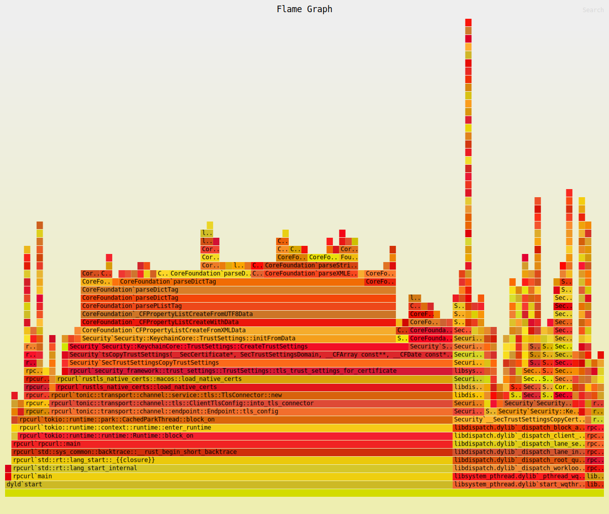

## rpcurl

krpc客户端测试工具
```bash
cargo add clap --features derive
```

```bash
export KRPC_TOKEN=env.token 
export REMOTE="http://127.0.0.1:50051"
export DEMO="$REMOTE/demo-java-server/Demo"
# powershell
$Env:DEMO = "" 
# 🍀 测试正常返回
cargo run $DEMO/hello -d '{"name":"我是Rust","age":28}' -H a=123 -H 123=c-id -v
# 🍀 文件作为输入数据
cargo run $DEMO/hello -f test.json
# ❌ 测试logicError
cargo run $DEMO/testLogicError -d 123
# 🌱 测试bytes
cargo run $DEMO/bytesTime
```


测试不同数据：

```bash
rpcurl $DEMO/testRuntimeException
rpcurl $DEMO/testMap
rpcurl $DEMO/inc100 -d 123
# widows / powershell 双引号转义下  -d '\"krpc\"'
rpcurl $DEMO/str -d '"krpc"'
# input bytes now not support. maybe  base64:schema later.
rpcurl $DEMO/incBytes -d '[123,233,456]'
```

## 性能火焰图



```bash
#cargo install flamegraph
sudo flamegraph -- rpcurl $DEMO/hello -d '{"name":"我是Rust","age":28}' -v
```