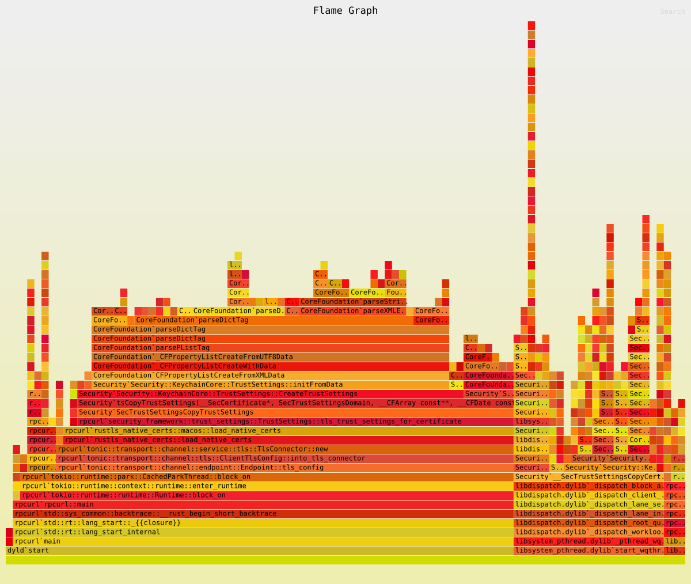

## rpcurl

krpc客户端测试工具
```bash
cargo add clap --features derive
```

```bash
export KRPC_TOKEN=env.token 
export REMOTE="http://127.0.0.1:50051"
export DEMO="$REMOTE/demo-java-server/Demo"
# powershell
$Env:DEMO = "" 
# 🍀 测试正常返回
cargo run $DEMO/hello -d '{"name":"我是Rust","age":28}' -H a=123 -H 123=c-id -v
# 🍀 文件作为输入数据
cargo run $DEMO/hello -f test.json
# ❌ 测试logicError
cargo run $DEMO/testLogicError -d 123
# 🌱 测试bytes
cargo run $DEMO/bytesTime
```


测试不同数据：

```bash
rpcurl $DEMO/testRuntimeException
rpcurl $DEMO/testMap
rpcurl $DEMO/inc100 -d 123
# widows / powershell 双引号转义下  -d '\"krpc\"'
rpcurl $DEMO/str -d '"krpc"'
# input bytes now not support. maybe  base64:schema later.
rpcurl $DEMO/incBytes -d '[123,233,456]'
```

## Agent-ready output & introspection

**Output routing.** Success data goes to **stdout**; every error goes to
**stderr (fd2)** with a non-zero exit code. Verbose (`-v`) diagnostics also go to
stderr, so stdout stays pure data even under `-v`. Exit codes:

| code | meaning |
|------|---------|
| 0 | success |
| 1 | remote error (server reachable, returned an error — gRPC `Status` or `Out::Error`) |
| 2 | usage error (bad url / json / file / args, including CLI parse errors) |
| 3 | connect error (could not reach the endpoint) |
| 4 | protocol error (server reached but replied non-2xx or with an unparseable body) |

**`--json`.** Machine mode: pure JSON on stdout (no emoji/decoration). Every
error — including CLI argument parse errors — is emitted as a single-line JSON
object on stderr:
`{"error":{"kind":"connect|usage|remote|protocol","msg":"...","code":<grpc-code?>}}`.
Default (human) mode keeps the 🍀 / 🌱 / ❌ prefixes. `--help` / `--version`
print to stdout and exit 0 in both modes.

```bash
rpcurl --json $DEMO/hello -d '{"name":"KRPC"}'   # {"code":0,"data":{...}} on stdout
```

**Introspection** (plain HTTP against the server's `/agent/discover`):

```bash
rpcurl discover http://127.0.0.1:50051                  # list services/methods
rpcurl schema   http://127.0.0.1:50051 Hello/hello       # JSON-schema for one method
rpcurl example  http://127.0.0.1:50051 Hello/hello       # skeleton input JSON
```

All three accept `--json` for pure-JSON stdout.

## 性能火焰图



```bash
#cargo install flamegraph
sudo flamegraph -- rpcurl $DEMO/hello -d '{"name":"我是Rust","age":28}' -v
```